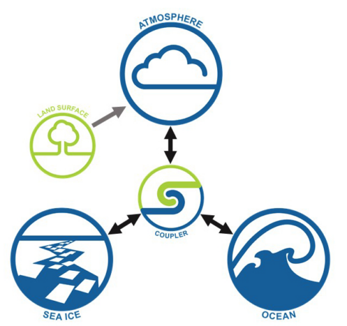

# **ACCESS-CM2**
{align=right width=50%}

<i>(Why there is no aerosol component in the diagram on the right taken from ACESS-NRI website?)</i>

ACCESS-CM2 (ACCESS Coupled Model 2) is a global fully-coupled climate model that includes the atmosphere, ocean and sea-ice components, and produces physical climate simulations. ACCESS-CM2 is one of the two models run by the Australian climate community for the 
<a href = "https://www.wcrp-climate.org/wgcm-cmip" target="_blank"> Coupled Model Intercomparison Project, CMIP</a>.
 

## ACCESS-CM2 configurations

- Atmosphere model (UM10.6): N96 resolution (1.875° x 1.25°, 85 levels). Physical model only – no carbon cycle.

- Land surface model (CABLE2.5) 

- Ocean model (MOM5): Tripolar grid, 1° resolution, 50 levels.

- Sea ice model (CICE5.1) 

    | COMPONENT     | MODEL         | VERSION               |
    | ------------- | ------------- | --------------------- |
    | Atmosphere    | UM            | 10.6                  |
    | Land Surface  | CABLE         | 2.5 (integrated in UM)|
    | Ocean         | MOM	        | 5                     |
    | Sea Ice       | CICE          | 5.1                   |
    | Coupler       | OASIS-MCT     | 3                     |
## Getting started with ACCESS-CM2
*(Heidi)*