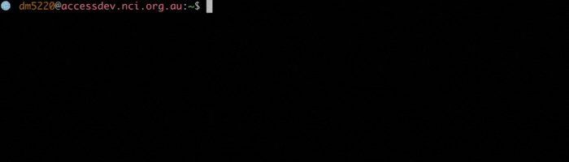
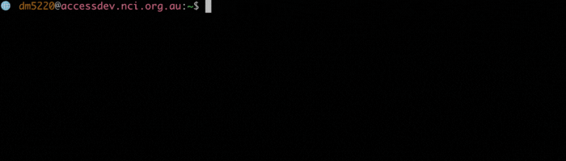
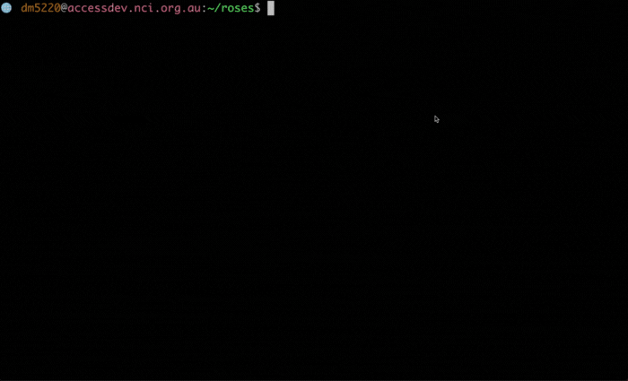
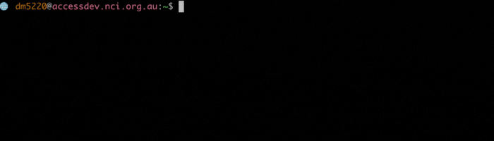

<!-- ---
hide:
    - toc
--- -->
<!-- Lines above to hide table of content -->
# Rose, Cylc and Rosie

ACCESS-CM2 is a set of sub-models (eg. UM, MOM, CICE, CABLE, OASIS) with a range of model parameters, input data, and computer related information, that need to be packaged together as a <i>suite</i> in order to run.
 
Each ACCESS-CM2 suite has an ID, in the format <code>u-[suite-name]</code>, with <code>[suite-name]</code> being a unique identifier (e.g. <code>u-br565</code> is the CMIP6 release preindustrial experiment suite).
 
Typically, an existing suite is copied and then edited as needed for a particular run.
 

## Copying ACCESS-CM2 suites with Rosie

<a href = "http://metomi.github.io/rose/doc/html/tutorial/rose/rosie.html" target="_blank">Rosie</a> is an <a href = "https://subversion.apache.org/" target="_blank">SVN</a> repository wrapper with a set of options to work with ACCESS-CM2 suites.
 
To copy an existing suite, on <i>accessdev</i>:
<!-- Change this to gadi/ARE when it will be completely possible to run CM2 fully on gadi-->
<ol>
    <li>
        Run <code>mosrs-auth</code> to authenticate using your MOSRS credentials (see 
        <a href="access_cm2/getting-started/#met-office-science-repository-service-mosrs" target="_blank">Met Office Science Repository Service (MOSRS)</a> for troubleshooting):
         
        
    </li>
    <li>
        Run <code>rosie checkout [suite-ID]</code> to create a local copy of the <code>[suite-ID]</code> from the UKMO repository (used mostly for testing and examining existing suites):
         
        
         
        Alternatively, run <code>rosie copy [suite-ID]</code> to create a new full copy (local and remote in the UKMO repository) rather than just a local copy. When a new suite is created in this way, a new unique name is generated within the repository, and populated with some descriptive information about the suite along with all the initial configuration details:
         
        
    </li>
</ol>
For additional <code>rosie</code> options, run <code>rosie help</code>.
  
The suites are created in the user's <i>accessdev</i> home directory, under <code>~/roses/[suite-ID]</code>.
 
The suite directory usually contains 2 subdirectories and 3 files:
<ul>
    <li><code>app</code> --> directory containing the configuration files for the various tasks within the suite.</li>
    <li><code>meta</code> --> directory containing the GUI metadata.</li>
    <li><code>rose-suite.conf</code> --> the main suite configuration file.</li>
    <li><code>rose-suite.info</code> --> suite information file.</li>
    <li><code>suite.rc</code> --> the Cylc control script file (Jinja2 language).</li>
    
</ul>

## Rose and top-level suite configuration

<a href = "http://metomi.github.io/rose/doc/html/index.html" target="_blank">Rose</a> is a configuration editor which can be used to view, edit, or run an ACCESS-CM2 suite.
 
To edit a suite configuration, on <i>accessdev</i>:
<!-- Change this to gadi/ARE when it will be completely possible to run CM2 fully on gadi-->
<ol>
    <li>
        Run <code>rose edit &</code> (the <code>&</code> is optional and keeps the terminal prompt active while runs the GUI as a separate process) from inside the relevant suite directory (e.g. <code>~/roses/u-[suite_ID]</code>) to open the Rose GUI and inspect the suite information.
         
        
    </li>
    <li>
        There are many settings that can be changed in a Rose GUI. However, there are a few that we definitely want to check and edit before we run a suite:
        <ul>
            <li>
                NCI Project
                 
                To make sure we run the suite under the NCI project we belong to, we can navigate to <i>suite conf --> Machine and Runtime Options</i> and edit the <i>Compute project</i> field. (Check <a href="https://opus.nci.org.au/display/Help/How+to+connect+to+a+project" target="_blank">how to connect to a project</a> if you have not joined one yet).
                If, for example, we belong to the <i>tm70</i> Project (ACCESS-NRI), we will insert <code>tm70</code> in the <i>Compute project</i> field:
                 
                
            </li>
            <li>
                Total Run length / Cycling frequency
                 
                ACCESS-CM2 suites are often run in multiple steps, each of them constituting a cycle, with the job scheduler resubmitting the suite every chosen <i>Cycling frequency</i>, until the <i>Total Run length</i> is met.
                 
                To modify these parameters, we can navigate to <i>suite conf --> Run Initialisation and Cycling</i> and edit the respective fields. The values are in the <a href="https://en.wikipedia.org/wiki/ISO_8601#Durations" target="_blank">ISO 8601 Duration</a> format.
                 
                If, for example, we want to run the suite for a total of 50 Years, and resubmit every year, we will change <i>Total Run length</i> to <code>P50Y</code> and <i>Cycling frequency</i> to <code>P1Y</code>. Note that the current maximum <i>Cycling frequency</i> is 2 years:
                 
                
            </li>
            <li>
                Wallclock time
                 
                The <i>Wallclock time</i> is the time requested by the <a href="getting-started/#pbs-jobs" target="_blank">PBS job</a> to run a single cycle. If this time is not enough for the suite to end its cycle, our job will be terminated before the suite can complete the run. 
                 
                If we change the <i>Cycling frequency</i>, we might need to change the <i>Wallclock time</i> accordingly. 
                 
                The time needed for the suite to run a full cycle depends on several factors, but a good estimation can be 4 hours per simulated year.
                 
                To modify the <i>Wallclock time</i>, we can navigate to <i>suite conf --> Run Initialisation and Cycling</i> and edit the respective field. The value is in the <a href="https://en.wikipedia.org/wiki/ISO_8601#Durations" target="_blank">ISO 8601 Duration</a> format.
            </li>
        </ul>
    </li>
</ol>

## Cylc 

       
Note that each suite directory is copied to Gadi
when it is run with cylc, where the scripts are then sent to the PBS job queue.
There are two ways of editing a suite, approaches that can be used individually or in
conjunction, whichever the user finds most useful or easier. One is to use the Rose
GUI, the other is to use a text/terminal editor (e.g. nano, nedit, etc.).

Note that each suite directory is copied to Gadi when it is run with cylc, where the scripts are then sent to the PBS job queue. There are two ways to edit a suite:

1. Use the Rose GUI
2. Use a text/terminal editor (e.g. nano, emacs, etc.).

Rose and cylc are invariably used together in rose/cylc suites.

Pronounced ‘silk’, [cylc](https://cylc.github.io/cylc-doc/7.8.8/html/index.html) is a workflow engine that automatically executes tasks according to schedules and dependencies. Effectively a job scheduler, cylc deals with specifications for how the job will be run and the time steps of each sub-model.

Cylc also provides important capabilities for monitoring jobs, particularly for dealing with jobs that have failed during processing but can be restarted from a previous timestep (rather than starting all over again).

At NCI, the current version cylc 7 will be soon replaced by cylc 8. 
 
<!-- References -->
 
<h6>References:</h6>
<ul style="font-size:0.8em;">
    <li>
        <a href = "https://confluence.csiro.au/display/ACCESS/Using+CM2+suites+in+Rose+and+Cylc" target="_blank">https://confluence.csiro.au/display/ACCESS/Using+CM2+suites+in+Rose+and+Cylc</a>
    </li>
    <li>
        <a href = "https://nespclimate.com.au/wp-content/uploads/2020/10/Instruction-document-Getting_started_with_ACCESS.pdf" target="_blank">https://nespclimate.com.au/wp-content/uploads/2020/10/Instruction-document-Getting_started_with_ACCESS.pdf</a>
    </li>
    <li>
        <a href = "https://code.metoffice.gov.uk/doc/um/latest/um-training/rose-gui.html" target="_blank">https://code.metoffice.gov.uk/doc/um/latest/um-training/rose-gui.html</a>
    </li>
</ul>