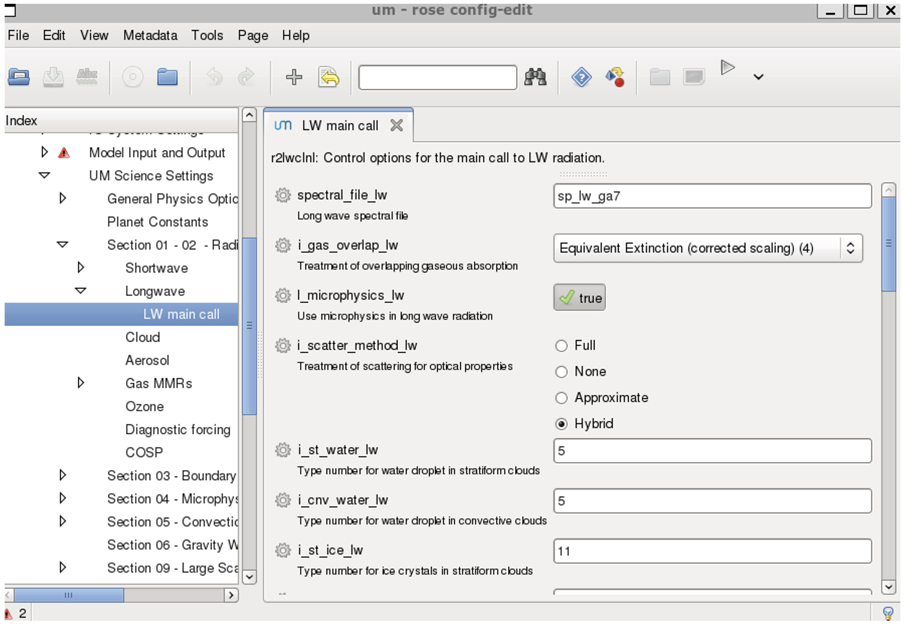

# Rose, Cylc and Rosie
ACCESS-CM and ACCESS-ESM are a set of sub-models (e.g. UM, MOM, CICE, CABLE and OASIS) with a range of model parameters, input data, and computer related information, that need to be packaged together as a *suite* in order to run. Typically, an existing suite is copied and then edited as needed for a particular run. The suite resides in a directory created in the user’s accessdev `cylc-run` directory, e.g. `~/cylc-run/u-br565` (u-br565 is the ACCESS-CM2 preindustrial experiment release suite). 

Note that each suite directory is copied to Gadi when it is run with cylc, where the scripts are then sent to the PBS job queue. There are two ways to edit a suite:

1. Use the Rose GUI
2. Use a text/terminal editor (e.g. nano, emacs, etc.).

Rose and cylc are invariably used together in rose/cylc suites.

## Rose 
[Rose](http://metomi.github.io/rose/doc/html/index.html) is a toolkit for writing, editing and running application configurations. Effectively a configuration editor, Rose starts a GUI to edit a rose suite, which is run from your suite directory on accessdev as follows: 

`cd ~/roses/u-[suite]`

`rose edit &` 

This creates a dialog box similar to the one shown below, where the `&` is optional (it keeps the terminal prompt active and runs the GUI as a separate process). 

Alternatively, the following files can be edited directly using a text editor: 

`~/roses/u-[suite]/rose-suite.conf`

`~/roses/u-[suite]/rose-suite.info`

`~/roses/u-[suite]/suite.rc`

## Cylc 
Pronounced ‘silk’, [cylc](https://cylc.github.io/cylc-doc/7.8.8/html/index.html) is a workflow engine that automatically executes tasks according to schedules and dependencies. Effectively a job scheduler, cylc deals with specifications for how the job will be run and the time steps of each sub-model.

Cylc also provides important capabilities for monitoring jobs, particularly for dealing with jobs that have failed during processing but can be restarted from a previous timestep (rather than starting all over again).

At NCI, the current version cylc 7 will be soon replaced by cylc 8. 
 
## Rosie
[Rosie](http://metomi.github.io/rose/doc/html/tutorial/rose/rosie.html) is a script with a set of high level options to work with rose, handling suite storage and discovery. Common commands include: 

`rosie copy u-[suite]` # copy an existing suite (a new suite name is assigned) 

`rosie checkout u-[suite]` # create a local copy of an existing suite 

`rosie go`   # suite management 

`rosie create`   # create a new suite 

When a new suite is created, a new name is generated within the repository system. This is populated with some descriptive information about the suite along with all the initial configuration details, much of which is automatically generated. 