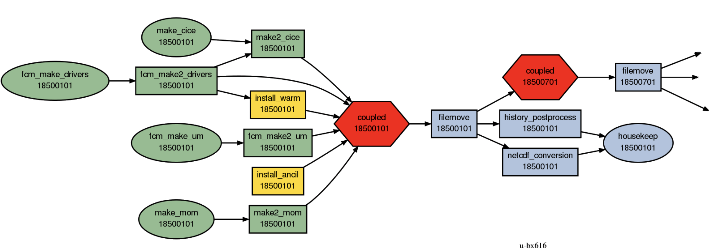
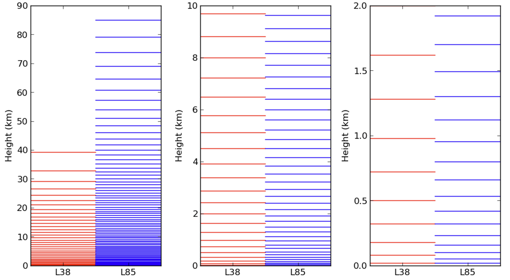

# ACCESS Model Specifications

## Suite Structure
A flow chart describing the ACCESS-CM2 suite structure is shown below.

## Vertical Resolution
Comparison of the vertical resolution of 38 and 85 vertical levels used in the ACCESS-ESM1.5 (L38) and ACCESS-CM2 (L85) configurations, respectively. 

